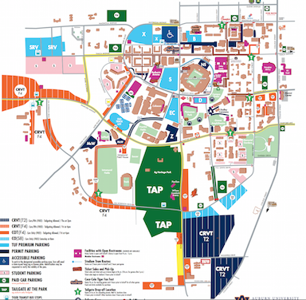
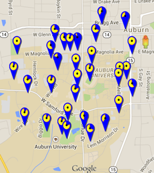
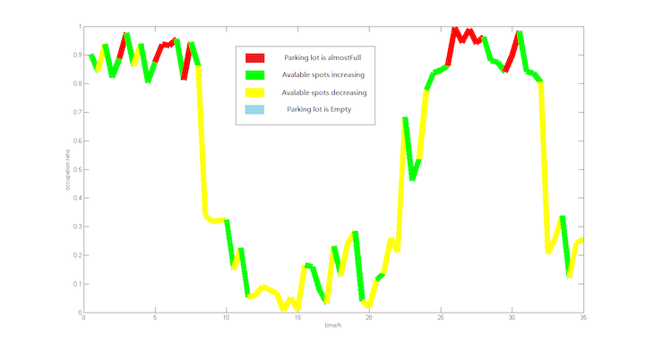

# Datafest-Ipark

##### `An parking app, to reduce the chaos behind football game day parking，decrease traffic and increase the enjoyment of the game day experience.`

## Overview


Our hope is that by providing information about the availability of parking in the different lots around campus, we can decrease traffic and increase the enjoyment of the game day experience. Our app is based on the Google Maps API. We have implemented a system where the user can log into our website and check how full a particular parking lot is by checking the map. Further, the user can reserve a spot on the map to indicate they have parked in the lot. The users can also map a route to where they are trying to go. We would like to implement an algorithm to predict the amount of spaces taken by people either not using the app or who have not updated their information. Overall, we  are trying to use information to combat the parking issues.


The parking app was written by current Computer Science and Eletrical Engineering students at Auburn University. Our back end part is written in the Scala functional programming language, while our frontend is by Html and javascripts. 

## Back End Feature
The back end service is implemented by Play Framework with Scala language. There are several features under the back end system:

* It builds web applications in the built-in `JBoss Netty` web server.
* Asynchronized response is supported in our system. Play framework only uses a fixed thread pool to process requests, and suspended the request till thread is available.


## Install and Run
Before running this app:

* OpenJDK 1.7
* Scala 2.11.*
* sbt 0.13.5

Run this app:
```
$ sbt
> run
$ open http://localhost:9000
```

## Prediction Model

### 1. Objective
IPark could successfully make parking lot reservations on a timely basis, formalizing a huge data collection of  reservation history. We proposed a Hidden Markov Model based Occupation Ratio Prediction Model with reservation history as training data. Our model could prediction the occupation of any parking lot at any time.

### 2. Preliminaries
In simpler Markov models, the state is directly visible to the observer, and therefore the state transition probabilities are the only parameters. In a hidden Markov model, the state is not directly visible, but output, dependent on the state, is visible. Each state has a probability distribution over the possible output tokens. Therefore the sequence of tokens generated by an HMM gives some information about the sequence of states. Note that the adjective 'hidden' refers to the state sequence through which the model passes, not to the parameters of the model; the model is still referred to as a 'hidden' Markov model even if these parameters are known exactly.

A hidden Markov model can be considered a generalization of a mixture model where the hidden variables, which control the mixture component to be selected for each observation, are related through a Markov process rather than independent of each other. [^2]


### 3.	Model Design

To instantiate a reasonable HMM, we proposed 4 states as below:
Full: The status of a specific parking lot is full, there is no open spot.
Empty: The status of a specific parking lot is empty, all spots are available.
Increasing:  More parking spots will be taken.
Decreasing: More parking spots will be freed.
Those 4 states could cover all the possibilities of an existing parking lot.[^1]
To maximize the sensitivity of our model, we proposed 10 types of observations.
1 indicates 0-10% of occupation ratio of a parking lot
2 indicates 10-20% of occupation ratio of a parking lot
3 indicates 20-30% of occupation ratio of a parking lot
4 indicates 30-40% of occupation ratio of a parking lot
5 indicates 40-50% of occupation ratio of a parking lot
6 indicates 50-60% of occupation ratio of a parking lot
7 indicates 60-70% of occupation ratio of a parking lot
8 indicates 70-80% of occupation ratio of a parking lot
9 indicates 80-90% of occupation ratio of a parking lot
10 indicates 90-100% of occupation ratio of a parking lot
 
Our observation data is a sequence of numbers from 1 to 10 indicates the occupation ratio of a parking lot with 30 minutes interval.


We use 10^4 observations as training set and 5000 observations as test set. The precision of status prediction reached approximately 70%.

### 4.	Conclusion

Based on our model, we could predict the occupation trend of a parking lot at anytime.


This figure shows the prediction of the parking lot state where y axis represents the occuptation ratio, color signify the parking states, and x axis represents 35 hours.  As we can see, the data predicted by our model is close to the real scenarios. When the number of available parking lots is increasing or decreasing, the trend in the figure reflects the real life very well.

Occupation Ratio Prediction Model is extremely useful at crowdsourcing situation such as Game Day. If a customer would like to make a reservation in an hour, we could not only provide currently empty spot, but also anticipate empty spot. If we predicted that one parking lot would be full in an hour, we would recommend customers to reserve others. We believe out model is a solution to maximize the utility of parking spots, especially with limited resource.

## Future Capabilities
We would like to make our information 100% accurate so the information is as useful as possible. This will assure the site is actually utilized by our target user base of Auburn game day parkers. To accomplish this goal we have two main options. First, many of the parking lots have humans assigned to the entrance to the lots already to enforce rules. If we could give them a link or a clicker to update the data in real time, the information could reach 100% accuracy. Alternatively, we could put sensors at the entrance and exit to automatically update the data in real time to eliminate human error. 

Furthermore this website need not be limited to only Auburn. Game day parking is a problem on many campuses throughout the world. By allowing users to add parking lots on their own, this website could help people park all over the world!


[^1]: Hidder Markov Model <http://en.wikipedia.org/wiki/Hidden_Markov_model>

[^2]: jahmm <https://code.google.com/p/jahmm/>
